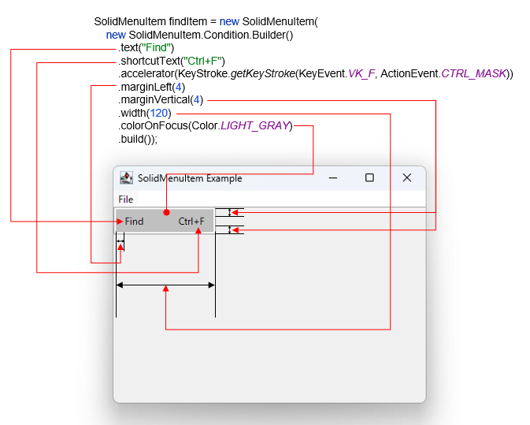

# Overview

UI library of Swing extensions that further refine the OS-native look and feel, usability, and operating experience
It is licensed under [MIT license](https://opensource.org/licenses/MIT).

[](https://maven-badges.herokuapp.com/maven-central/org.riversun/solidui)


# Install

## maven
- You can add dependencies to maven pom.xml file.
```xml

<dependency>
    <groupId>org.riversun</groupId>
    <artifactId>solidui</artifactId>
    <version>0.1.0</version>
</dependency>
```

# Quick start

## JMenuItem

Each Condition property used for initialization is associated with a MenuItem as follows



```java
package example;

import org.riversun.solidui.jmenuitem.SolidMenuItem;

import java.awt.event.ActionEvent;
import java.awt.event.KeyEvent;

import javax.swing.JFrame;
import javax.swing.JMenu;
import javax.swing.JMenuBar;
import javax.swing.JOptionPane;
import javax.swing.KeyStroke;
import javax.swing.SwingUtilities;
import javax.swing.UIManager;

public class SolidMenuItemExample {

  public static void main(String[] args) throws Exception {
    // System.setProperty("jsse.enableSNIExtension", "false");

    UIManager.setLookAndFeel(UIManager.getSystemLookAndFeelClassName());
    SwingUtilities.invokeLater(() -> createAndShowGUI());
  }

  private static void createAndShowGUI() {
    // Create the main application frame
    JFrame frame = new JFrame("CustomMenuItem Example");
    frame.setDefaultCloseOperation(JFrame.EXIT_ON_CLOSE);
    frame.setSize(400, 300);

    // Create a menu bar
    JMenuBar menuBar = new JMenuBar();

    // Create a top-level menu
    JMenu fileMenu = new JMenu("File");

    // Create a CustomMenuItem with text, shortcut text, and a keyboard accelerator
    SolidMenuItem findItem = new SolidMenuItem(new SolidMenuItem.Condition.Builder()
        .text("Find")
        .shortcutText("Ctrl+F")
        .accelerator(KeyStroke.getKeyStroke(KeyEvent.VK_F, ActionEvent.CTRL_MASK))
        .marginLeft(4)
        .marginVertical(4)
        .width(120)
        .colorOnFocus(Color.LIGHT_GRAY)
        .build());

    // Add an action listener to the custom menu item
    findItem.addActionListener(e -> JOptionPane.showMessageDialog(frame, "Find action triggered"));

    // Add the custom menu item to the top-level menu
    fileMenu.add(findItem);

    // Add the top-level menu to the menu bar
    menuBar.add(fileMenu);

    // Set the menu bar for the main application frame
    frame.setJMenuBar(menuBar);

    // Display the main application frame
    frame.setVisible(true);
  }
}

```
